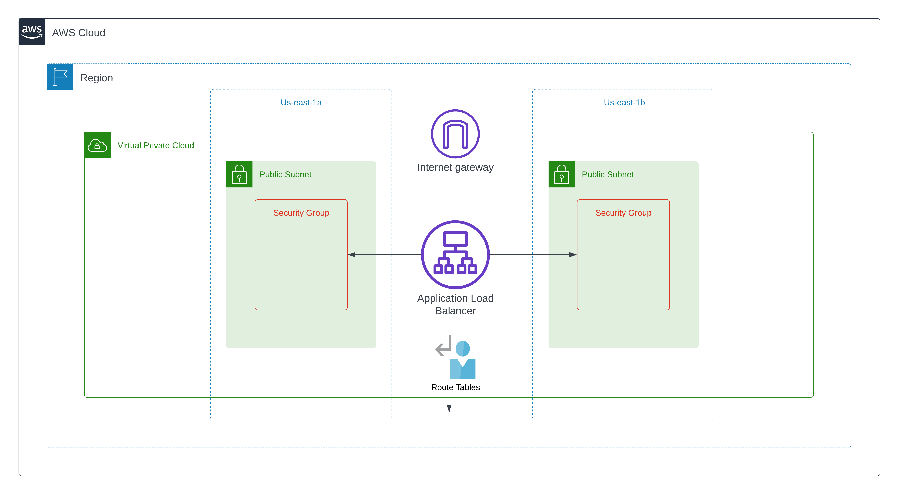
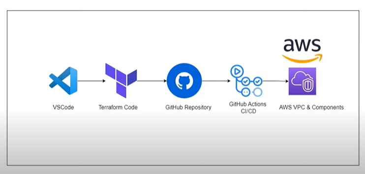

# VPC Creation with Terraform & GitHub Actions

This GitHub repository is a comprehensive guide and automation project for creating Virtual Private Clouds (VPCs) using Terraform and harnessing the power of GitHub Actions for infrastructure as code (IaC) deployment and management.

## Key Features

1. **Terraform Infrastructure as Code:** We provide Terraform scripts for defining and provisioning VPC resources. Manage your VPC configuration in a structured, version-controlled manner.

2. **GitHub Actions Workflow:** Automate the deployment and management of your VPC infrastructure with GitHub Actions. Easily trigger updates, rollbacks, and more directly from your repository.

3. **Modular and Scalable:** Our Terraform modules and configurations are designed to be modular, making it easy to extend and adapt the VPC to your specific needs.

4. **Security Best Practices:** Learn how to implement security best practices for your VPC, including network ACLs, security groups, and more.

5. **Documentation:** Detailed documentation is provided to guide you through the process, helping you understand the Terraform code and GitHub Actions workflows.

## Getting Started

To get started with creating your own VPC using Terraform and GitHub Actions, simply clone this repository and follow the step-by-step instructions provided in the documentation.

### Architecture


### Execution Flow


### Branching Strategy
**Feature Branch Workflow :** A Git branching model that encourages collaboration and isolation of new features or bug fixes in separate branches before they are merged into the main codebase.

* Create a feature branch: 
    ```bash
    git checkout -b feature/
    ```
* Make your changes, commit them, and push the branch to the remote repository:
    ```bash
    git push --set-upstream origin feature/update-readme
    ```
* Switch to the main branch:
    ```bash
    git checkout main
    ```  
* Merge the feature branch into the main branch: 
    ```bash
    git merge feature/
    ```
* After merging, push the changes to the remote repository.    
    ```bash
    git push origin main
    ```
* Once the feature branch has been merged and is no longer needed, you can delete it.
    ```bash
    git branch -d feature/ # Locally
    git push origin --delete feature/  # Remotely
    ```    
This branching strategy is helpful for keeping your main branch clean and always deployable. Feature branches provide isolation and allow team members to work on different tasks simultaneously without interfering with each other. It also makes it easier to track changes and manage the development process.


## License

This project is licensed under the MIT License. See the [LICENSE](LICENSE) file for details.

## Maintainer

Kirubel Fikru Weldesemayat

## Contact

If you have any questions or need assistance, feel free to open an issue or reach out to me at kirubelfikruwsh@gmail.com.
